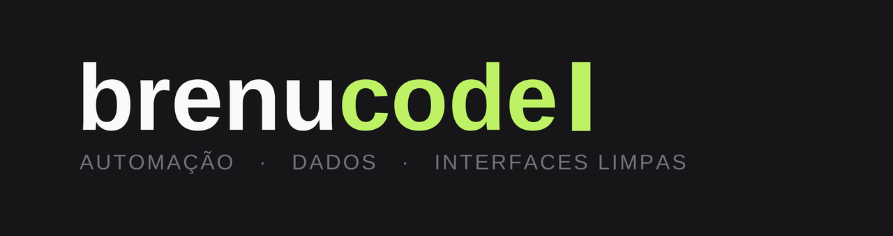

  

  

 

I've been at the top of every leaderboard I've touched — and at some point that turned into taking games apart instead of just winning them. It started with **Minecraft**: first playing it, then writing **external cheats and HWID spoofers** (in `C++` and `C#`) that other people copied and shipped as their own. **Reverse engineering** was the real addiction — figuring out how things actually work underneath.

These days I aim that the other way around. I'm a **full-stack developer** building **fiscal & accounting automation** and **SaaS** that runs in production — XML turning into spreadsheets, bank statements reconciling themselves, routines nobody wants to do by hand. I work all day, so I code for fun. That's where **Velo** comes from.

 

## 🎹 Velo — an open-source MIDI ecosystem

A clean MIDI player, an audio→MIDI transcriber, and a song library — designed, built and self-hosted end to end.

- **[Velo](https://github.com/brenucode/velo-midiplayer)** — a clean MIDI player with a practice studio and a fullscreen stage visualizer. Plays MIDI into in-game pianos (QWERTY) or to MIDI output. **Windows & Linux.**
- **[VeloScribe](https://github.com/brenucode/veloscribe)** — drop in audio (or paste a link) and get a clean piano `.mid` back. Desktop app **+** Discord bot, powered by a PyTorch transcription model.
- **[velomidi.com](https://velomidi.com)** — the home of Velo: a searchable MIDI library with Discord login, uploads and live announcements. `Next.js` + `Prisma`, self-hosted on my own VPS.

 

## 🛠️ Tech I reach for

  <code>TypeScript</code> &nbsp;·&nbsp; <code>Python</code> &nbsp;·&nbsp; <code>C++</code> &nbsp;·&nbsp; <code>C#</code> &nbsp;·&nbsp; <code>Next.js</code> &nbsp;·&nbsp; <code>React</code> &nbsp;·&nbsp; <code>Tailwind</code> &nbsp;·&nbsp; <code>Supabase</code> &nbsp;·&nbsp; <code>PostgreSQL</code> &nbsp;·&nbsp; <code>Prisma</code> &nbsp;·&nbsp; <code>PyTorch</code>

 

  
  &nbsp;
  

 

  OFF THE CLOCK 
  🎮 <strong>FACEIT Level 10</strong> (CS) &nbsp;·&nbsp; 🎹 <strong>piano since I was 9</strong> &nbsp;·&nbsp; 🛠️ always building something

 

  <a href="https://velomidi.com"><b>velomidi.com</b></a> &nbsp;·&nbsp; <a href="https://discord.gg/velomidi"><b>Discord</b></a>

built in my spare time — because not every project needs a reason.

